<div align="center">



<br/>
<br/>

[](https://mini-emotion-cipher.vercel.app)
[](https://mini-emotion-cipher.onrender.com/health)
[](https://github.com/Ananya2306/Mini-Emotion-Cipher)
[](#)

<br/>

[](https://python.org)
[](https://flask.palletsprojects.com)
[](https://nextjs.org)
[](https://typescriptlang.org)
[](https://huggingface.co/j-hartmann/emotion-english-distilroberta-base)
[](#)

<br/>

> ### *"Words stay private. Feelings stay readable."*
> An intelligent system that encrypts your messages using **AES-256**
> while preserving their **emotional signature** — detectable by AI even through encryption.

</div>

---

## 🎬 Demo

<div align="center">

### 🎥 ▶ Watch Full Demo Video

https://github.com/user-attachments/assets/cb5a684d-7ea4-4d14-8b72-68ef4ac030a9

---

| Encrypt Mode | Decrypt Mode |
|:---:|:---:|
| Type a message → AI detects emotion | Paste cipher JSON → recover message + emotion |
| AES-256 encrypts with emotion-derived key | Emotion signature decoded from payload |

</div>

---

## 💡 The Big Idea

```
Normal Encryption:    "I'm thrilled!" ──────────▶  ████████████
                                                    (everything hidden)

Emotion Cipher:       "I'm thrilled!" ──────────▶  7xK2@mNpLqR9...
                                                         ↑
                                               words hidden ✅
                                               joy: 96.1% detectable ✅
```

Most encryption systems hide *everything* — text, tone, and feeling alike.

**mini Emotion Cipher** is different. It uses the **emotion itself as part of the AES key**, so:
- 🔐 Your **words** are completely encrypted
- 💛 Your **feeling** is embedded in the cipher — readable by AI, invisible to humans
- 🔁 The **full message** is recovered later using the emotion package

---

## ✨ How It Works

<div align="center">

</div>

<br/>

**1️⃣ You type a message**
```
"I just got the job offer! I'm so thrilled and can't wait to start!"
```

**2️⃣ AI detects emotion** *(j-hartmann/distilroberta)*
```json
[{ "label": "joy", "score": 0.9610 }]
```

**3️⃣ Emotion-derived AES key is generated**
```python
key = SHA256("joy:0.9610")   # → 32-byte AES-256 key
```

**4️⃣ Payload is built with emotion embedded**
```
joy:0.9610||I just got the job offer! I'm so thrilled and can't wait to start!
──────────  ────────────────────────────────────────────────────────────────────
  header                        original text
```

**5️⃣ AES-256-CBC encrypts the entire payload**
```
/wNnDvgb4wQWBgiRpVfuSg==.PsBpc6aPBmnId6hMV3NrBJGBHsbUabWjVvOy...
```

**6️⃣ Output is a portable JSON package**
```json
{
  "ciphertext": "/wNnDvgb4wQWBgiRpVfuSg==.PsBpc6aPBmn...",
  "emotions": [{ "label": "joy", "score": 0.9610 }]
}
```

> 📦 Share this JSON — anyone can decrypt to recover the original message AND the emotion!

---

## 🏗️ Architecture

```
┌────────────────────────────────────────────────────────────────────┐
│                   FRONTEND · Next.js · Vercel                       │
│                                                                      │
│   ╔══════════════╗               ╔══════════════════╗               │
│   ║  ⚿ ENCRYPT   ║               ║    ◈ DECRYPT      ║               │
│   ║  Type message║               ║  Paste JSON pkg  ║               │
│   ║  POST/encrypt║               ║  POST /decrypt   ║               │
│   ╚══════╤═══════╝               ╚════════╤═════════╝               │
└──────────┼────────────────────────────────┼────────────────────────┘
           │                                │
           ▼                                ▼
┌────────────────────────────────────────────────────────────────────┐
│                    BACKEND · Flask · Render                          │
│                                                                      │
│   ┌──────────────────┐      ┌───────────────────────────────────┐  │
│   │  emotion.py      │      │  cipher.py                        │  │
│   │                  │      │                                   │  │
│   │ HuggingFace API  │─────▶│  payload = "joy:0.96||text"       │  │
│   │ distilroberta    │      │  key     = SHA256(emotion_str)    │  │
│   │ → emotions[]     │      │  ct      = AES256_CBC(payload,key)│  │
│   └──────────────────┘      └───────────────────────────────────┘  │
└────────────────────────────────────────────────────────────────────┘
```

---

## 🎯 Features

<table>
<tr>
<td width="50%">

### 🔐 Security
- **AES-256-CBC** encryption
- **Emotion-derived keys** via SHA-256
- Random IV per encryption
- Portable JSON cipher package
- Full round-trip encryption/decryption

</td>
<td width="50%">

### 🤖 AI Intelligence
- **DistilRoBERTa** emotion classifier
- 7 emotions: joy, sadness, anger, fear, disgust, surprise, neutral
- Confidence scores per emotion
- HuggingFace Inference API

</td>
</tr>
<tr>
<td width="50%">

### 🎨 User Experience
- Glassmorphism dark UI
- Emotion-reactive color system
- Smooth animations & transitions
- Copy-to-clipboard cipher packages
- Mobile responsive design

</td>
<td width="50%">

### 🎮 Engagement
- 🔥 Encryption streak counter
- 📊 Session emotion pattern chart
- 💬 Random message suggestions
- 📤 Shareable emotion cards
- ✍️ Live character counter (280 max)

</td>
</tr>
</table>

---

## 📁 Project Structure

```
mini-emotion-cipher/
│
├── 🎨 frontend/                      ← Next.js · TypeScript · Tailwind
│   ├── app/
│   │   ├── page.tsx
│   │   ├── layout.tsx
│   │   └── globals.css               ← Glassmorphism styles
│   ├── components/
│   │   ├── emotion-cipher.tsx        ← Main app component
│   │   ├── emotion-badge.tsx         ← Colored emotion chips
│   │   └── history-item.tsx          ← Session history
│   └── .env.local                    ← NEXT_PUBLIC_API_URL
│
├── ⚙️ backend/                       ← Flask · Python · Render
│   ├── app.py                        ← API routes (/encrypt /decrypt /health)
│   ├── emotion.py                    ← HuggingFace emotion detection
│   ├── cipher.py                     ← AES-256 encrypt/decrypt
│   ├── requirements.txt
│   └── render.yaml
│
├── 🖼️ banner.svg                     ← Animated README header
├── 🖼️ flow.svg                       ← Encryption flow diagram
└── 📄 README.md
```

---

## 🚀 Run Locally

### Prerequisites
```
Python 3.11+  ·  Node.js 18+  ·  HuggingFace account (free)
```

### 1️⃣ Clone
```bash
git clone https://github.com/Ananya2306/Mini-Emotion-Cipher.git
cd Mini-Emotion-Cipher
```

### 2️⃣ Backend
```bash
cd backend
python -m venv venv
venv\Scripts\activate          # Windows
# source venv/bin/activate     # Mac/Linux

pip install -r requirements.txt

# Get free token at huggingface.co/settings/tokens
echo "HF_TOKEN=hf_your_token" > .env

python app.py
# ✅ http://127.0.0.1:5000
```

### 3️⃣ Frontend
```bash
cd ../frontend
npm install
echo "NEXT_PUBLIC_API_URL=http://127.0.0.1:5000" > .env.local
npm run dev
# ✅ http://localhost:3000
```

### 4️⃣ Test the API
```bash
# Encrypt
curl -X POST http://127.0.0.1:5000/encrypt \
  -H "Content-Type: application/json" \
  -d '{"text": "I am so happy today!"}'

# ✅ Response:
# { "ciphertext": "...", "emotions": [{"label": "joy", "score": 0.9616}] }
```

---

## 🌐 Deployment

| | Platform | URL | Status |
|---|---|---|:---:|
| 🎨 Frontend | Vercel | [mini-emotion-cipher.vercel.app](https://mini-emotion-cipher.vercel.app) | ✅ Live |
| ⚙️ Backend | Render | [mini-emotion-cipher.onrender.com](https://mini-emotion-cipher.onrender.com/health) | ✅ Live |

```bash
# Render env vars
HF_TOKEN=hf_xxxxxxxxxxxx

# Vercel env vars
NEXT_PUBLIC_API_URL=https://mini-emotion-cipher.onrender.com
```

---

## 📊 Evaluation Criteria

| Criteria | Weight | Our Approach |
|---|:---:|---|
| 🎯 **Impact** | 20% | Live full-stack app with real AI emotion detection + AES encryption |
| 💡 **Innovation** | 20% | Emotion-as-AES-key — feelings cryptographically drive encryption |
| ⚙️ **Technical Execution** | 20% | Clean modular code, error handling, proper REST API, this README |
| 🎨 **User Experience** | 25% | Glassmorphism UI, streak system, suggestions, shareable cards, hosted |
| 🎬 **Presentation** | 15% | Animated diagrams, architecture visuals, demo video |

---

## 🔬 The Crypto Innovation

```python
# The core idea — cipher.py
def derive_key(emotions: list[dict]) -> bytes:
    """Emotion IS the key. Wrong emotion = garbage output."""
    emotion_string = "|".join(
        f"{e['label']}:{round(e['score'], 4)}"
        for e in emotions
    )
    return hashlib.sha256(emotion_string.encode()).digest()
    # 32 bytes = AES-256 key
```

The emotion isn't just metadata — it **actively participates in cryptography**.  
Try decrypting with the wrong emotion → you get garbage.  
This cryptographically **proves** the emotion was correctly identified. ✅

---

## 🔮 Future Scope

- [ ] Multi-language emotion detection
- [ ] Threshold decryption — message only decryptable if emotion score > X%
- [ ] Emotion timeline visualization across conversations
- [ ] Browser extension for encrypting emails
- [ ] Mobile app with biometric + emotion dual-authentication

---

<div align="center">

**Built by Ananya — [@Ananya2306](https://github.com/Ananya2306)**

*UnsaidTalks Emotion-Aware Encryption Hackathon 2026*

<br/>

---

*"In a world where data is exposed, emotions deserve privacy too."*

<br/>

[](https://mini-emotion-cipher.vercel.app)

</div>


